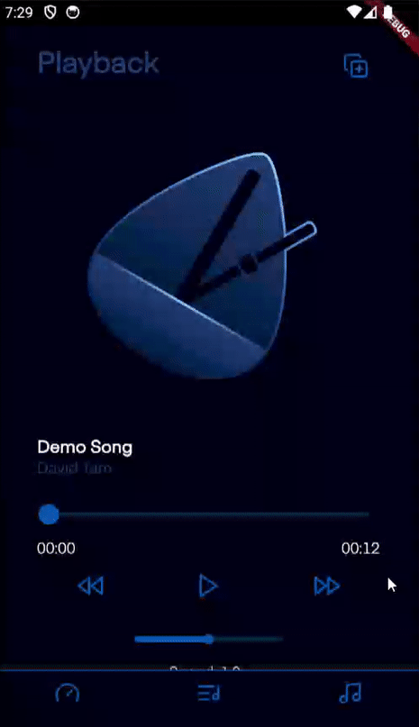

# PickPro

PickPro is a tool that empowers guitarists to learn their favourite songs.

 

## Features

PickPro has 3 main functionalities: 
- A custom-built metronome
- A searchable chords reference sheet
- An audio player with precise playback speed modification

These features can all be accessed simultaneously, meaning you can overlay the metronome over your songs or reference chords as the song is playing.

## App Screenshots

> Metronome

*Users can customize the BPM by either using the text field or sliding the weight on the wand.*

> Chords List

*Users can filter by note and tune using the dropdown bars.*

> Audio Player

*Users can customize the speed and scrub through the song with ease. They can also upload their own files using the button in the top right corner.*

## Inspiration

My inspiration for creating PickPro came from my dissatisfaction with the resources currently available for learning electric guitar. Not only were different resources often spread across multiple sites, many sites also locked key features behind paywalls that I simply couldn't agree with. Most prominent among them all, however, was the lack of readily available audio players with fine-tuned playback speed customization. Services like YouTube Music limit customizations to increments of 0.25 - 0.5x, gaps that are simply too large for a guitarist-in-training like myself to jump between when playing along. 

PickPro, on the other hand, offers the most precise playback modification on the free market, allowing users to play along to any of their songs at their own pace.
